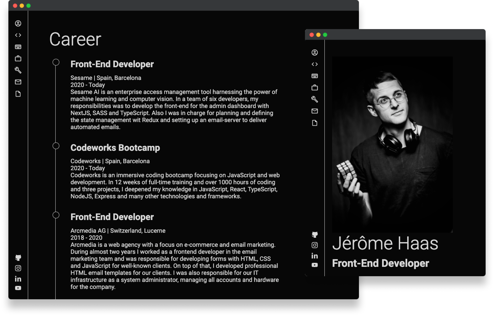

# Portfolio Website

Hi there, I'm Jérôme - a passionate front-end developer from Switzerland!
Experienced in React, TypeScript, MongoDB and SCSS and with some knowledge in Express, Koa and Angular.
I am a passionate developer with a quick perception. I prefer to work with frontend technologies in small teams. I like the challenge and there is nothing better for me than developing creative and solid solutions for the web.
In my spare time you can find me on running tracks, abroad on bagpacking trips or in front of my favorite IDE.